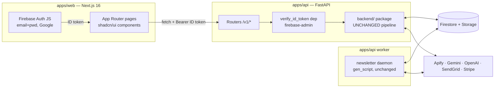

# FeedTLDR Rebuild Plan: Streamlit → Next.js + FastAPI

**Goal:** replace the Streamlit frontend with a modern TypeScript frontend (Next.js + shadcn/ui, styled per [DESIGN.md](DESIGN.md)) while keeping every piece of backend logic — Apify scraping, Gemini summarization, TTS audio, SendGrid email, Firebase data, Stripe billing, credits, and the daily newsletter daemon — functionally unchanged. Same Firebase project, same Stripe account, same user data: **zero data migration**. This repo (`PabloWiedemann/FeedTLDR`) becomes the home of all new code.

**Strategy in one sentence:** the pipeline already reports progress through a UI-agnostic channel (the Firestore `pipeline_status` document that Streamlit merely polls), so the split is a strangler-fig move — wrap the intact Python backend in a thin FastAPI layer, point a new Next.js app at it, and retire Streamlit only when parity is proven.

---

## 1. Current state (source: `../feedtldr_streamlit`)

### 1.1 What the product does today

| Area | Features |
| --- | --- |
| Marketing | Landing page, about/contact/legal pages, pricing page with Stripe checkout + customer portal |
| Auth | Firebase Auth email+password and Google OAuth; secure-cookie sessions; signup validation; 3-step onboarding; TOS acceptance |
| Feed | Summary page (HTML summary + TTS audio player + generation timestamp in user TZ); demo summary from `default_user` for new users; Source-data tab (metrics, 3 charts, raw tweet table from CSV in Firebase Storage) |
| Generation | Dialog: fetch-latest vs re-summarize toggle, theme presets (General/ML/Politics/Finance from `prompt_config`), custom prompt, credit-cost preview, validation (accounts exist / verified / enough credits); background thread runs pipeline; UI polls Firestore `pipeline_status` every 8s |
| Settings | X accounts (add/remove chips, batch verification via Apify, import followees from an account), newsletter email, AI prompt, timezone |
| Chat | AI chat about the feed (OpenAI `gpt-4o-mini` with feed context), credits per message |
| Billing | Plans free/basic/pro/admin (`plans_config`), monthly + prepaid credits, usage tracking, Stripe subscription sync, portal |
| Profile | Name edit, avatar (generated initials), delete account (Auth + Firestore + Stripe + confirmation email), logout |
| Daemon | `gen_script.py`: hourly check, generates + emails newsletters at 7am per user timezone, weekdays only, free-trial caps (5 newsletters), monthly usage resets on Stripe period |

### 1.2 The pipeline (unchanged, the crown jewels)

`backend/run_pipeline.py::run_flow_for_user(uid, email, followers, plan, timezone, prompt, skip_* flags, newsletter_email, credits_usage)`:

1. **Data collection** — Apify scrape (`twitter_scraper.py`, plan limits, timezone-windowed) or re-download previous CSV from Storage
2. **Summarization** — Gemini cached-content → HTML summary; transcript for audio
3. **Audio** — OpenAI `tts-1` → mp3 → Firebase Storage, unique hashed filename
4. **Metadata** — writes `summary_data.{summary_html, summary_transcript, audio_url, last_generation_time, raw_data_sources, generation_time_seconds}` to Firestore
5. **Email** — SendGrid newsletter (`emails_module`)

Each phase updates `pipeline_status` (`current_stage`, `status`, `stages_completed`, `error`) in Firestore and deducts credits (`CreditsCalculator` + `update_credit_usage`).

### 1.3 Coupling analysis: exactly where Streamlit leaks into kept code

Everything under `backend/` is headless **except** the four points below. This is the entire surgery list; all other Streamlit code (`pages/`, `sidebar.py`, `shared_components.py`, `account_popup.py`, `styling/`) is replaced by the new frontend and deleted at cutover.

| File | Leak | Disposition |
| --- | --- | --- |
| `backend/stripe_state.py` | Reads `st.session_state.user_id/stripe_id`; `st.toast`/`st.link_button` on errors | Rewrite as pure functions `create_checkout_session(uid, stripe_id, price_id) -> url`, `create_portal_session(stripe_id) -> url`, `create_stripe_customer(email, uid)`. Errors raise; API layer maps to HTTP errors |
| `utils.py::run_in_thread` | Uses `streamlit.runtime.scriptrunner` `get_script_run_ctx`/`add_script_run_ctx` (imported by `backend/run_pipeline.py`!) | Replace with plain `threading.Thread` version, identical decorator signature. 3-line change, behavior identical outside Streamlit (ctx is a no-op there anyway) |
| `utils.py` (rest) | `get_avatar_image` + cookie helpers use `st`/`extra_streamlit_components` | Keep the pure subset (`get_logger`, `save_to_file`, `convert_timezone_to_utc`, `convert_utc_to_custome_timezone`, `extract_number`, `extract_unique_usernames_from_raw_data`, `get_all_purchased_prepaid_credits_stripe`, `compute_credit_spenditure`). Drop cookies/avatar (replaced by Firebase Auth + client-side avatar) |
| `utils_user.py` | 118 `st.` calls (auth decorators, session hydration, OAuth flow) | Keep only the pure functions the daemon/API need: `get_all_users_timezones`, `get_user_subscription_info_from_stripe`, and the Firestore/Stripe core of `register_user_in_db` (extracted, de-Streamlit-ified, used by the signup endpoint). Everything else is replaced by Firebase Auth JS + token verification |
| `callbacks.py` | Generation trigger from UI (thread spawn + credit checks + usage bump) | Logic becomes `POST /v1/generations`; file deleted |

`gen_script.py` has **zero** `st.` calls and keeps working as the worker (only its `utils`/`utils_user` imports must point at the cleaned modules).

### 1.4 Config & external services (all unchanged)

- `config/plans_config.py` (limits + Stripe price IDs), `config/credits_config.py`, `config/prompt_config.py` (theme prompts + output-format prompts). `config/routing_config.py` dies with Streamlit.
- Env vars carried over: `FIREBASE_WEB_API_KEY`, `APIFY_API_KEY`, `GEMINI_API_KEY`, `OPENAI_API_KEY`, `SENDGRID_API_KEY`, `STRIPE_API_KEY_TEST/LIVE`, `STRIPE_ENV`, `DOMAIN_URL`, `PROJECT_DIR`, `CREDENTIALS_DIR` (+ `credentials/firebase_credentials_secret_prod.json`). `GOOGLE_REDIRECT_URI`/`google_client_secret.json` retire (Firebase JS SDK handles Google sign-in).
- Firestore schema (`customers/{uid}`) and Storage layout (`users/{email}_{uid}/latest|history/…`) unchanged.

---

## 2. Target architecture



### 2.1 Stack choices and why

| Layer | Choice | Rationale |
| --- | --- | --- |
| Frontend framework | **Next.js 16 (App Router) + React 19 + TypeScript strict** | The 2026 default for shadcn/ui (first-class `shadcn init` target); strongest conventions + largest documentation footprint, which is exactly what makes a codebase agent-friendly; SSG for marketing pages, client components behind auth for the app; easy Vercel deploy. Alternatives (Vite SPA, TanStack Start, Remix) add wiring without adding capability here |
| Styling | **Tailwind CSS v4** + CSS-variable tokens | shadcn's native theming path; tokens defined once in `globals.css` per DESIGN.md |
| Components | **shadcn/ui** restyled via tokens; **Phosphor** icons; **Motion** (`motion/react`) for the few animated moments | Owned code (components copied into repo, no library lock-in) = ideal for agentic iteration and the reusable component system requirement |
| Data fetching | **TanStack Query** + a typed client **generated from FastAPI's OpenAPI** (`openapi-typescript` + `openapi-fetch`) | Single source of truth for the contract; agents regenerate types instead of guessing shapes; Query handles polling/caching/optimistic updates |
| Forms | react-hook-form + zod | Standard, well-known to agents |
| Charts / table | Recharts + TanStack Table | Source-data tab parity |
| API | **FastAPI + uvicorn** (Python 3.10+, uv) | Wraps the existing Python backend in-process (no rewrite); pydantic already used in `run_pipeline`/`twitter_scraper`; free OpenAPI schema drives the TS client |
| Auth | **Firebase Auth JS SDK** on the client; API verifies ID tokens with `firebase-admin` (already a dependency) | Same Firebase users — nobody re-registers. Replaces the hand-rolled cookie/JWT/OAuth plumbing in `utils_user.py` wholesale |
| Worker | `gen_script.py` re-homed as `apps/api` entrypoint (`python -m worker`) in the same Docker image | Zero logic changes |

### 2.2 Repository layout (this repo)

```
FeedTLDR/
├── CLAUDE.md                  # agent guide (Phase 0)
├── README.md
├── docs/
│   ├── PLAN.md                # this file
│   └── DESIGN.md              # design system (source of truth for all UI)
├── apps/
│   ├── web/                   # Next.js 16 + TS + Tailwind v4 + shadcn/ui
│   │   ├── app/               # (marketing)/, (app)/app, /design gallery, api client
│   │   ├── components/ui/     # shadcn primitives (owned)
│   │   ├── components/feedtldr/  # composite component system (DESIGN.md §8)
│   │   └── lib/               # firebase.ts, api/ (generated client), utils
│   └── api/                   # Python (uv)
│       ├── backend/           # ← moved VERBATIM from old repo (pipeline, scraper, ml, emails, firebase, credits)
│       ├── config/            # ← moved verbatim (minus routing_config)
│       ├── utils.py           # pure subset + plain-thread run_in_thread (§1.3)
│       ├── utils_user.py      # trimmed to pure functions (§1.3)
│       ├── api/               # NEW: FastAPI app — main.py, deps.py, schemas.py, routers/
│       ├── worker/            # gen_script.py (imports fixed, logic unchanged)
│       ├── tests/             # ← moved from old repo + new API contract tests
│       └── pyproject.toml     # uv; streamlit deps removed; fastapi/uvicorn added
└── .github/workflows/ci.yml   # lint + typecheck + tests for both apps
```

Keeping the old repo's flat import layout inside `apps/api/` (`backend/`, `config/`, `utils.py` at the API root) means **`backend/` moves with zero import rewrites** — the "keep the backend intact" requirement taken literally. The old repo stays untouched as reference/fallback until cutover, then gets archived.

---

## 3. API contract (v1)

All `/v1/*` endpoints require `Authorization: Bearer <Firebase ID token>` unless marked public. FastAPI dependency resolves `uid`/`email` once; plan/credit enforcement moves **server-side** (today some checks live only in Streamlit UI — closing that gap is a deliberate improvement, same rules, same calculator).

| Endpoint | Maps to existing code |
| --- | --- |
| `GET /healthz` (public) | — |
| `POST /v1/auth/register` | extracted core of `register_user_in_db` (Firestore doc + Stripe customer). Client creates the Firebase Auth user first, then calls this |
| `GET /v1/me` | `initialize_user_data` reads + `sync_subscription_plan` (lazy Stripe sync, same as today's `update_user_plan`) → profile, plan, usage, credits left |
| `PATCH /v1/me` | name/timezone updates via `update_data_firestore_DB` |
| `DELETE /v1/me` | delete-account flow (`delete_user_from_firebase*`, Stripe cancel, `send_delete_account_email`) |
| `GET /v1/settings` / `PUT /v1/settings` | `settings_global.{ai_prompt, newsletter_email, timezone}` |
| `GET /v1/settings/accounts` | `settings_X.{accounts, verified_accounts}` |
| `POST /v1/settings/accounts` `{handles[]}` | add + plan-limit check (`PLAN_PROPERTIES[plan].limits.max_followers`) |
| `DELETE /v1/settings/accounts/{handle}` | remove from both lists |
| `POST /v1/settings/accounts/verify` | `verify_account_exists` (Apify batch) → `{verified[], not_found[]}` |
| `POST /v1/settings/accounts/import` `{source}` | `scrape_accounts_followers` + credits (`compute_followers_scraping_credits`) |
| `GET /v1/feed` | `summary_data.*`; `?demo=true` (public) serves the `default_user` doc for logged-out preview + empty state |
| `GET /v1/feed/source-data` | downloads `raw_data_sources` CSV from Storage, returns rows + server-computed aggregates (posts/likes/views, per-account, timeline) — pandas already in deps |
| `GET /v1/generations/cost?fetch_latest=` | `CreditsCalculator` preview (mirrors `gen_dialog` math) |
| `POST /v1/generations` `{fetch_latest, prompt?}` → `202` | `callbacks.generate_content` logic: validate accounts/verified/credits → spawn thread → `run_flow_for_user(...)` → bump `n_generations` on success |
| `GET /v1/generations/status` | reads `pipeline_status` (the existing seam; client polls every 5–8s exactly like Streamlit did) |
| `POST /v1/chat` `{messages[]}` | `pages/chat.py` logic: feed context + `use_gpt`, chat-credit deduction; plain JSON v1, SSE streaming later |
| `GET /v1/billing/plans` (public) | `PLAN_PROPERTIES` (prices, limits) for the pricing page |
| `POST /v1/billing/checkout` `{price_id}` → `{url}` | de-Streamlit-ified `stripe_state` |
| `POST /v1/billing/portal` → `{url}` | idem |
| `GET /v1/billing/usage` | `fetch_plan_usage_data` + `compute_credits_left` |

Cross-cutting: pydantic response models for everything (drives the generated TS client); CORS locked to the web origin; single-flight guard on `POST /v1/generations` (reject if `pipeline_status.status == "in_progress"`); `summary_html` sanitized server-side (bleach/nh3 allowlist) — today raw LLM HTML goes straight into `st.html`, the rebuild closes that XSS hole.

---

## 4. Frontend information architecture

Routes: `/` `(marketing)`, `/pricing`, `/login`, `/signup`, `/onboarding`, `/app` (feed), `/app/chat`, `/design` (component gallery, dev-only), legal pages. Settings is a **left Sheet over `/app`** (per mock), not a route — deep-linkable via `/app?settings=open`. Auth-gated `(app)` layout redirects logged-out users to `/login`; marketing pages are static/SSG.

Page-by-page specs, states, and the component system live in [DESIGN.md §8–9](DESIGN.md). Feature parity mapping worth calling out:

- Mock 2's "Re-Generate" button opens the **generate dialog** (fetch-latest vs re-summarize + cost), preserving today's credit-preview flow.
- Mock 3's email list maps to today's **single** `newsletter_email` — UI renders it as a one-item chip list. Multi-recipient is a backend change, explicitly out of scope for parity (logged in §8 as a fast-follow).
- Summary rendering v1 = sanitized `summary_html` in `SummaryProse` (backend untouched). A fast-follow can switch `DEFAULT_TEXT_OUTPUT_FORMAT_PROMPT` to emit structured JSON (`sections[{headline, body, links[]}]`) for pixel-perfect FeedSection rendering — prompt-only change, worth doing once parity ships.

---

## 5. Phased roadmap

Each phase ends green (lint + typecheck + tests) and independently reviewable. Sizes assume focused agentic sessions.

**Phase 0 — Repo foundation (1 session).** Scaffold layout from §2.2; root CLAUDE.md (see §7); CI running ruff + pytest (api) and eslint + tsc (web) on empty shells; .gitignore (secrets, credentials/, .env, logs/); first commit + push.
✅ CI green on main; CLAUDE.md lets a fresh agent orient in one read.

**Phase 1 — Backend re-home + de-Streamlit surgery (1–2 sessions).** Copy `backend/`, `config/`, `tests/` verbatim; apply the four §1.3 surgeries; `pyproject.toml` without streamlit/streamlit-extras/navigation-bar/extra-streamlit-components/pyperclip/avinit; worker imports fixed.
✅ `uv run pytest` passes the migrated suite; `grep -r "streamlit" apps/api --include="*.py"` → zero hits; a manual `run_flow_for_user` smoke run against a test user completes end-to-end.

**Phase 2 — FastAPI layer (2–3 sessions).** Auth dependency, routers per §3, pydantic schemas, background generation with single-flight, CORS, error taxonomy, HTML sanitization; contract tests with Firebase emulator or a test uid; OpenAPI export script → checked-in `openapi.json`.
✅ Full flow via curl: register → settings → verify accounts → generate → poll status → feed returns fresh summary + audio URL.

**Phase 3 — Web scaffold + design system (2 sessions).** `create-next-app` (TS, Tailwind v4) + `shadcn init`; tokens/fonts per DESIGN.md; brand assets ported; generated API client + TanStack Query + Firebase Auth provider; build the component inventory (DESIGN.md §8) with all states; `/design` gallery.
✅ `/design` renders every component in every state, matching DESIGN.md on visual inspection against the mocks.

**Phase 4 — Product pages (3–4 sessions).** Auth pages + onboarding; feed page (demo/loaded/generating/error states, AudioPill, source-data tab); settings sheet (accounts CRUD + verify + import, email, prompt/theme, timezone); generate dialog + progress polling; chat; profile menu + delete account.
✅ A brand-new user can sign up, onboard, verify accounts, generate, listen, chat, and change settings entirely in the new UI against the real API.

**Phase 5 — Marketing + billing (1–2 sessions).** Landing (mock 1), pricing page with checkout/portal + usage meters, legal/about/contact, SEO meta + OG images, sitemap.
✅ Stripe test-mode checkout → plan upgrades in Firestore → UI reflects it (lazy sync on `/v1/me`).

**Phase 6 — Parity QA + hardening (1–2 sessions).** Playwright e2e for the golden path (mock external services); `/better-interface full` review + fixes; accessibility pass (DESIGN.md §10); Lighthouse (LCP < 2.5s on landing); parity checklist sweep of §1.1 feature table, item by item, against the old app side-by-side.
✅ Zero HIGH findings; parity checklist signed off; e2e green in CI.

**Phase 7 — Deploy + cutover (1 session + monitoring).** API + worker: one Docker image, two processes (`uvicorn` / `python -m worker`) on Railway/Fly/Render; web on Vercel; env matrix + secrets (service-account JSON via env, not committed); staging pass with `STRIPE_ENV=test`; DNS: `feedtldr.com` → Vercel, `api.feedtldr.com` → API; update `DOMAIN_URL` (Stripe success/cancel URLs) and SendGrid links; monitor first scheduled newsletter cycle; archive the Streamlit repo (read-only) after 2 clean weeks.
✅ Old app off, new app serving, one full daemon cycle delivers newsletters on schedule. Rollback = point DNS back (old repo remains deployable until archive).

**Fast-follows (post-cutover backlog):** structured-JSON summary format; multi-recipient newsletter; SSE progress instead of polling (or Firestore `onSnapshot` + security rules); chat streaming; Stripe webhooks replacing lazy sync; dark theme; migrate deprecated `google-generativeai` SDK → `google-genai`; PostHog analytics.

---

## 6. Testing & quality gates

- **api:** migrated pytest suite must stay green (behavioral anchor that the backend survived the move); new contract tests per router; `schemathesis` run against `openapi.json` optional.
- **web:** vitest for lib/logic; Playwright for auth→generate→feed golden path (API mocked via fixtures) + a settings CRUD spec; `/design` gallery is the visual-review surface for every component PR.
- **Cross:** generated client is CI-checked against `openapi.json` (drift fails the build); `grep`-gate keeps `streamlit` out of `apps/api`.
- **Design:** DESIGN.md §11 checklist on every UI PR; `/better-interface quick` on touched screens at each phase exit, `full` at Phase 6.

## 7. Agentic working agreements (seed for CLAUDE.md, written in Phase 0)

- Read `docs/PLAN.md` for scope/architecture and `docs/DESIGN.md` before any UI work; never invent tokens or styles inline.
- Commands: `pnpm dev|lint|typecheck|test` in `apps/web`; `uv run uvicorn api.main:app --reload`, `uv run pytest`, `uv run python -m worker` in `apps/api`.
- Backend files under `apps/api/backend/` are **frozen** during the rebuild: bug fixes only, no refactors, until after cutover.
- API changes always: pydantic schema → regenerate `openapi.json` → regenerate TS client (`pnpm gen:api`) in the same PR.
- New UI = compose from `components/feedtldr/` + `components/ui/`; add to `/design` gallery in the same PR; all states required.
- Secrets never committed; `.env.example` kept current in both apps.

## 8. Risks & open decisions

| # | Risk / decision | Call made here (change if you disagree) |
| --- | --- | --- |
| 1 | **Where does `gen_script.py` run today?** Not visible in the repo (likely a VM/local box) | Phase 7 blocker to resolve: replicate as the containerized worker; confirm the old instance is stopped at cutover so users don't get double newsletters |
| 2 | Monorepo vs. keeping backend in the old repo | Monorepo (this repo): one clone gives agents full context; old repo archived after cutover |
| 3 | Progress updates: polling vs realtime | Poll `GET /v1/generations/status` every 5–8s (identical to today, zero new infra). Firestore `onSnapshot` would need client security rules — deferred |
| 4 | Summary format | Keep `summary_html` (sanitized) for parity; structured JSON as fast-follow via prompt change only |
| 5 | Plan enforcement gaps | Enforcement moves server-side in Phase 2 (today several checks are UI-only). Same rules; slightly stricter in effect |
| 6 | `google-generativeai` SDK is deprecated (→ `google-genai`) | Do **not** migrate during the rebuild (backend frozen); fast-follow |
| 7 | LLM HTML → XSS | Sanitize server-side in Phase 2 (improvement over `st.html` today) |
| 8 | Mock's light-blue links fail AA contrast on cream | Darkened link token in DESIGN.md §2; hover may use the mock blue |
| 9 | Mock shows multi-email newsletter list; backend stores one | Ship single-email parity; multi-recipient is a schema + daemon change, fast-follow |
| 10 | Apify actor IDs hardcoded in `twitter_scraper.py`; scraping is inherently fragile | Untouched (frozen). Add API-level error surfacing so failures reach the UI with honest copy |
| 11 | Demo depends on `default_user` Firestore doc | Verify it exists in prod before Phase 4; seed script if missing |
| 12 | Dark mode | Light-only v1 (brand mock is light); tokens structured for a later dark theme |
| 13 | Old app keeps running during rebuild | Yes — both UIs share the same Firestore; safe because the new stack writes through the same functions |

---

*Next actions: Phase 0. From this repo: scaffold per §2.2, commit, push to `PabloWiedemann/FeedTLDR`, then start Phase 1 with the §1.3 surgery table as the worklist.*
